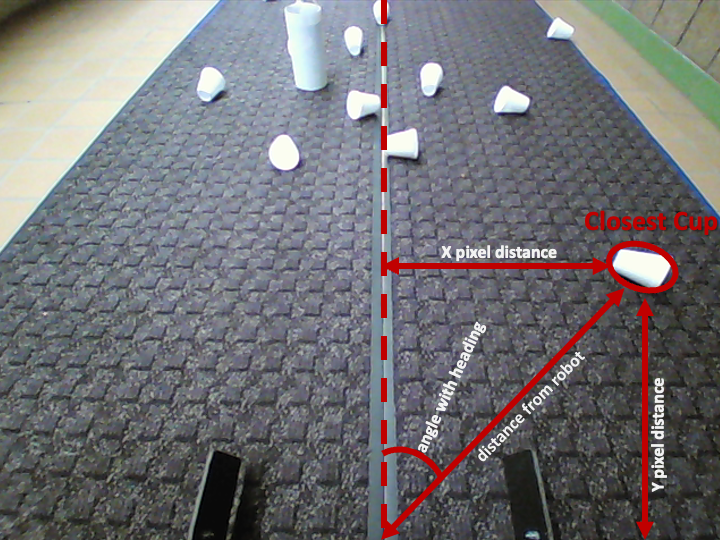
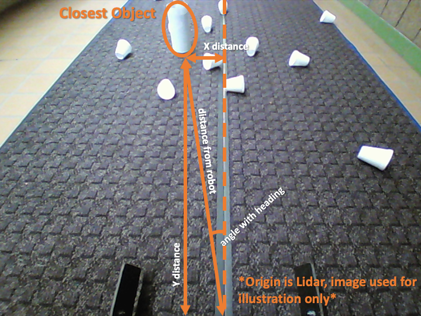
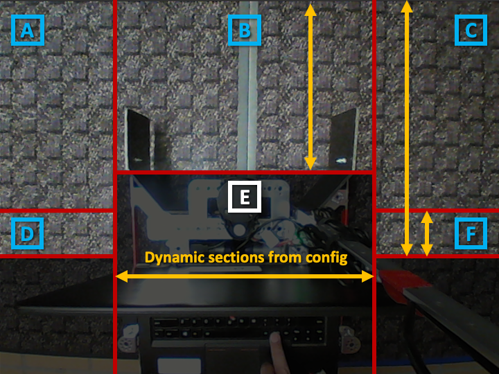
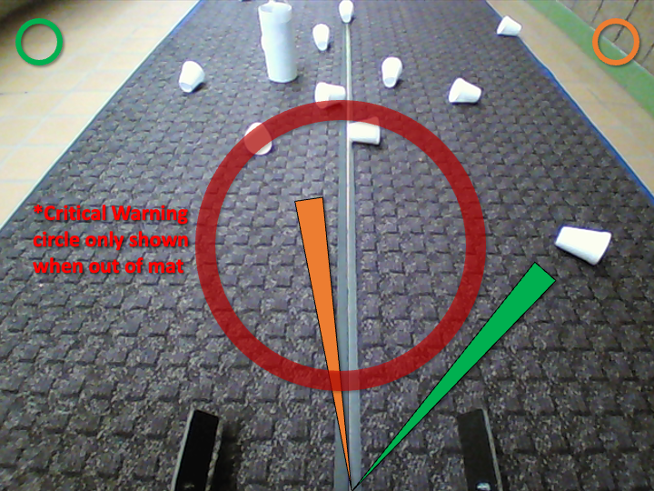
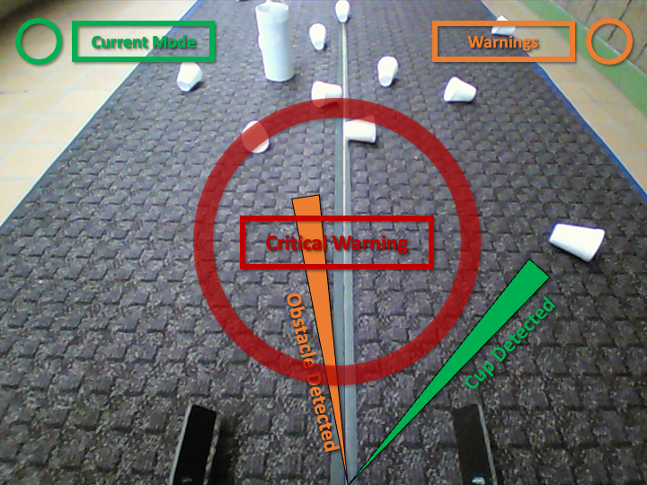

# `term_project_pkg`
A ros package to drive a snow removing robot to clear snow (white cups) while avoiding obstacles (white bottles) and staying inside bounds (near mat's blue edge).
### Primary functions are divided into individually functional nodes:
- Cup Detection `detect_cup` node
- Bottle Detection `detect_obstacle` node
- Mat Detection `inside_mat` node
- Movement Control `snow_blower` node
### Secondary nodes include:
- Dynamic Reconfigure from `rqt_reconfigure` package
- Joystick I/O from `joy` package
- Lidar Output from `lidar2d` package
- Camera Output from `simple_camera_publisher` package
    > _Note: Additional launch file required for simple_camera_publisher package ( __snow_blower_camera.launch__ ). Add file to {ROS_WS}/src/simple_camera_publisher/launch/_
- Motor Controller I/O from `prizm_ros` package

  

# `detect_cup Node`
Uses OpenCV library and camera input to find closed contours within configured pixel area to publish the location of the closest 'blob' for the snow removing robot.

## Input
- Image from front facing camera topic: `/cam_pub_front/image_raw`
#### Dynamic Parameters: 
- Minimum pixel area to consider contour (% of entire image)
- Maximum pixel area to consider contour (% of entire image)

## Process
_Input image -> Black & White image -> Find Contours -> Closest Contour's Position:_

## Output
- Output topic: `/blob`
    - message type: `geometry_msgs.msg/Twist` 
        > _Note: Twist msg used as data structure only_
    - __linear.x__  = x_axis distance from front of the robot (pixels)
    - __linear.y__  = y_axis distance from front of the robot (pixels)
    - __linear.z__  = direct distance from front of the robot (pixels)
    - __angular.z__ = angle with robot's heading (degrees)

  

# `detect_obstacle Node`
Uses input from Lidar to find objects within configured field of view to publish the location of the closest 'obstacle' for the snow removing robot.

## Input
- Lidar output topic: `/lidar2d/detect/scan`
#### Dynamic Parameters: 
- Field of view limits for detecting obstacles (degree)
- Entire robot's tank turning envelope (radius - mm)
- Width of the robot's path to pass obstacles on the side (mm)
- Pause detection toggle

## Process
_Lidar Input -> Filter Points in FOV -> Closest Point's Position:_

## Output
- Output topic: `/obstacle`
    - message type: `geometry_msgs.msg/Twist` 
    > _Note: Twist msg used as data structure only_
    - __linear.x__  = X-axis distance from sensor (meters)
    - __linear.y__  = Y-axis distance from sensor (meters)
    - __linear.z__  = Distance between sensor and obstacle (meters)
    - __angular.x__  = Forward Path is clear 0, obstacle 1
    - __angular.z__ = Obstacle's angle from front center (degrees)

  

# `inside_mat Node`
Uses OpenCV library and camera input to find color specific percentage of pixels in a cropped section of the image to publish detected edges (blue) and outside of mat (white) for the snow removing robot.

## Input
- Image from down facing camera topic: `/cam_pub_down/image_raw`
#### Dynamic Parameters: 
- Cropped section dimensions (% of rows/columns in the image)
- Black (0) & White (255) mat detection threshold
> _Note: Color range tuning can be inserted here if needed for other applications_
- Display bird's eye view toggle

## Process
_Input Image -> Color Masks -> Find Color % -> Display:_

 
## Output
- Output topic: `/edge`
    - message type: `geometry_msgs.msg/Twist` 
    > _Note: Twist msg used as data structure only_
    - __linear.x__  = A, Blue % Left side of robot
    - __linear.y__  = B, Blue % Front of robot
    - __linear.z__  = C, Blue % Right side of robot
    - __angular.x__  = D, Blue % Left Wheel of the robot
    - __angular.y__  = E, White % of entire image
    - __angular.z__ = F, Blue % Right Wheel of the robot

  

# `snow_blower Node`
Main control node that oversees multiple robot movement control modes. 
- __Autonomous mode__: Robot uses all of the above nodes and removes cups from the mat autonomously. 
- __Tele-Op mode__: Robot communicates with the operator using the Wireless Joystick and allows controlled movement. Uses Obstacle and Mat Detection to prevent collision or out of mat conditions, and warn operator of them using force feedback on the Joystick.
- __Joystick Override mode__: Allows the operator to override all safety features and move the robot in the event it gets stuck.

## Input
- Image from front facing camera topic: `/cam_pub_front/image_raw`
- Closest Cup input topic: `/blob`
- Closest Obstacle input topic: `/obstacle`
- Inside mat detection input topic: `/edge`
- Joystick input topic: `/joy`
    - Start Button: Switch between Tele-Op and Autonomous modes
    - LT + RT: Override all code and move the robot freely
    - A(2): Display additional information in front view
    - Left Stick Y axis: Move Forward/Backward
    - Right Stick X axis: Steer Left/Right

## Process
_Recieve all inputs -> Display information -> Use inputs with State Machine -> Move Robot_

### State Machine:
- Tele-Op or Joystick Override (Move using Joystick)
- Inside Mat
    - Front Edge Detected (Check other edges)
        - Left and Right Edge Detected (Push cups out of mat)
        - Left Edge Detected (Steer right)
        - Right Edge Detected (Steer left)
        - Along the Edge (Steer towards the inside of mat)
    - No Edge Detected (Go forward)
        - Path in the Front NOT clear (Turn away from obstacle)
        - Detect Cups in range (Steer towards the cups)
- Outside Mat (Try swing turn back in)

### Display Overlay:
Simple front view image without text for remote operator:

- Left circle shows current active control mode
    - Red: Joystick Override
    - Green: Autonomous
    - Blue: Tele-Op
- Right circle shows warnings (obstacle detected)
- Middle circle shows critical warnings (outside mat)
- Yellow pointer shows obstacle's direction, if detected
- Green pointer shows cup's direction, if in range

> _Note: Press A(2) button on Joystick for text output for above status indicators_

Front view image with text for remote operator (only boxed text displays):

## Output
- Motor Controller output topic: `/prizm/twist_controller/twist_cmd`
    - message type: `geometry_msgs.msg/Twist`
- Joystick Force Feedback output topic: `/joy/set_feedback`
    - message type: `sensor_msgs.msg/JoyFeedbackArray`

  

---

## License

[MIT](https://choosealicense.com/licenses/mit/)

 

## Made by: Devson Butani
dbutani@ltu.edu

 

I have neither given nor received any unauthorizedaid in completing this work,
nor have I presented someone else's work as my own.

Devson Butani

LTU ID: 000732711

Date: 12/13/2022